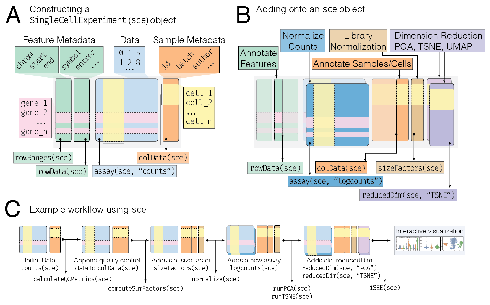

```{r setup, include=FALSE}
knitr::opts_chunk$set(echo = TRUE)
```

---
title: "Orchestrating Single-Cell Analysis with Bioconductor"
output: html_notebook
---

# Needed packages

```{r, message=FALSE}
# BiocManager::install("SingleCellExperiment")
# BiocManager::install(c("scater", "scran", "uwot"))

library(SingleCellExperiment)
```

The `sce` Object:



